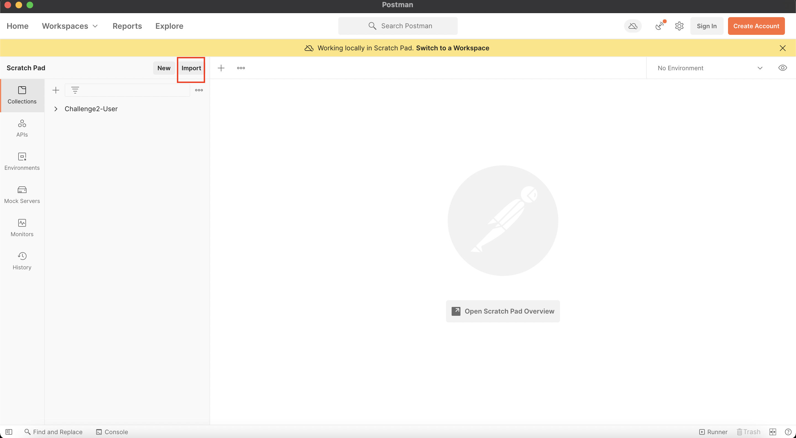

# Raúl Camisón Individual Challenge

### Run App Steps:

1. Start the container:

    `docker-compose -f docker-compose-RetoIndividual.yml  up -d --force-recreate`

2. Open Postman

3. Import `requestsChallengeIndividual.json` clicking **Import** in Postman App

4. Make Requests:

    Do the following request in order through postman ***(mdas-api-raul_camison)*** by clicking **Send** the data is already setup 
    
    

    **4.1.** Create many Users
    
    **4.2.** Add Pokemons as Favorite    

    **4.1.** Get Pokemon By Id

5. Run Tests:

    **5.1.** Docker Test Container

    In docker you can check if all the test are passed.
    Just check the log of the container with the following command in your favorite terminal or cmd:

    `docker logs -f test`

6. ¡Keep enjoying our App!

### [Return to README](README.md)